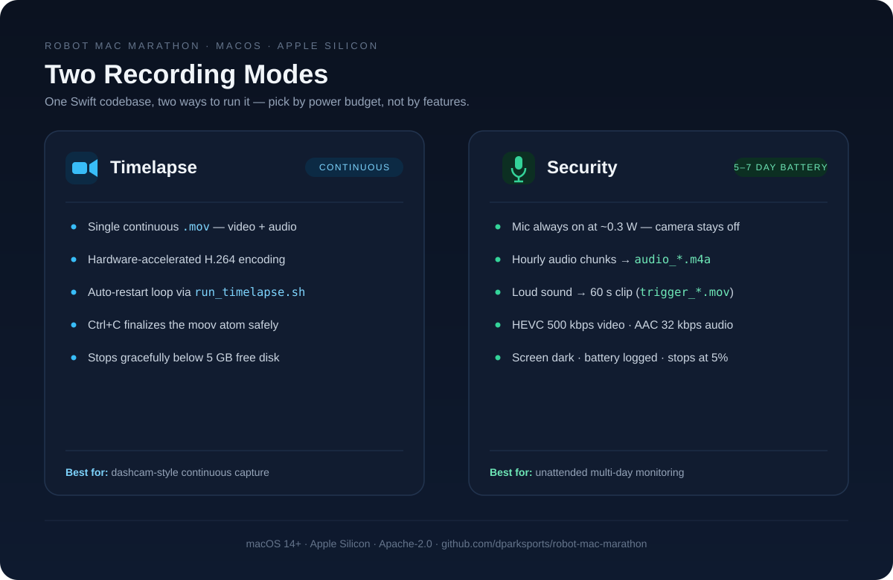
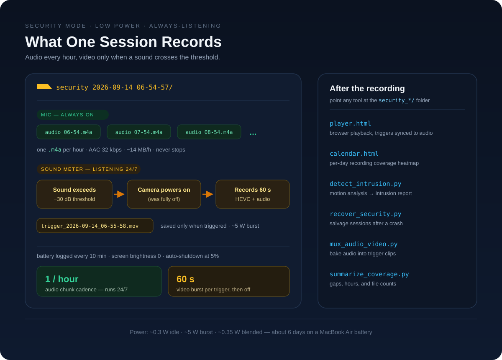

# Robot Mac Marathon

A reliable, async-signal-safe macOS command-line tool for capturing video and audio time-lapses — with a low-power security mode that listens for days on battery.

<p align="center">
  
</p>

## Download (v1.0.0)

A prebuilt Apple Silicon binary of the Security recorder is available on the [releases page](https://github.com/dparksports/robot-mac-marathon/releases/tag/v1.0.0):

- [`robot-security-timelapse-v1.0.0-macos-arm64.zip`](https://github.com/dparksports/robot-mac-marathon/releases/download/v1.0.0/robot-security-timelapse-v1.0.0-macos-arm64.zip) — the `timelapse_security` binary (Info.plist embedded), a `start.sh` restart wrapper, and a usage guide
- [`SHA256SUMS.txt`](https://github.com/dparksports/robot-mac-marathon/releases/download/v1.0.0/SHA256SUMS.txt) — SHA-256 checksum for the zip

Verify the download before unpacking it:

```bash
shasum -a 256 -c SHA256SUMS.txt
# robot-security-timelapse-v1.0.0-macos-arm64.zip: OK
```

The binary is unsigned, so clear the quarantine flag that macOS attaches to downloaded files, then start recording:

```bash
unzip robot-security-timelapse-v1.0.0-macos-arm64.zip
xattr -cr robot-security-timelapse-v1.0.0-macos-arm64
cd robot-security-timelapse-v1.0.0-macos-arm64
./start.sh
```

## Features
- Captures time-lapse frames from the default Mac camera at configurable intervals
- Synchronized audio capture from the default microphone
- Graceful shutdown handles `Ctrl+C` safely to ensure valid, playable output files
- Built-in disk space monitoring (stops gracefully if free space drops below 5GB)
- Hardware-accelerated H.264 encoding

## Requirements

- **macOS 14 (Sonoma) or later** — this tool uses AVFoundation APIs that require a recent version of macOS. It will not compile or run correctly on older versions.
- **Xcode Command Line Tools** — required for the `swiftc` compiler. Install with:
  ```bash
  xcode-select --install
  ```

### FFmpeg Dependencies

The Python recovery and muxing scripts require FFmpeg binaries locally. You can instantly install them into this folder without needing Homebrew:
```bash
./install_ffmpeg.sh
```

## Permissions (Camera & Microphone)

macOS requires explicit user consent for camera and microphone access. **This is a one-time setup** — once granted, the permission persists for the compiled binary.

### How to grant access

1. **On first run**, macOS will display a permission prompt asking for camera and microphone access. Click **Allow** for both.

2. **If you accidentally denied access**, or if the prompt didn't appear, go to:
   - **System Settings → Privacy & Security → Camera** — enable access for `timelapse` (or Terminal, if running via `swift`)
   - **System Settings → Privacy & Security → Microphone** — enable access for `timelapse` (or Terminal, if running via `swift`)

3. **To reset permissions** (forces the prompt to appear again):
   ```bash
   tccutil reset Camera
   tccutil reset Microphone
   ```

> **Note:** When running with `swift timelapse.swift` (interpreted mode), macOS associates the permission with **Terminal.app** (or your terminal emulator). When running the compiled binary (`./timelapse`), the permission is associated with the binary itself.

## Usage

### 1. Compile the script

```bash
swiftc timelapse.swift -o timelapse \
  -Xlinker -sectcreate -Xlinker __TEXT -Xlinker __info_plist -Xlinker Info.plist
```

This embeds the `Info.plist` into the binary so macOS can properly identify the app and show permission prompts.

### 2. Run the time-lapse
```bash
./timelapse
```
Or you can use the provided bash scripts for continuous looping:
```bash
./run_timelapse.sh
```

### 3. Graceful Exit
Press `Ctrl+C` once to gracefully terminate recording. The script will safely finalize the `moov` container atom to ensure the `.mov` file is valid and playable before exiting.

## Fixing Corrupted Files

If you have older recordings from a previous version of the script that crashed or failed to save properly (resulting in files missing the `moov` atom), a recovery script is included:

```bash
# Requires ffmpeg and a short "reference" recording created by the fixed script
python3 recover_mov.py
```

## Security Mode (Extended Battery)

A low-power security recording mode designed to run for **5–7+ days** on a MacBook Air battery.

<p align="center">
  
</p>

### How it works

- **Microphone records continuous hourly audio** (~0.3W) — the camera is **fully off**
- When sound exceeds a configurable dB threshold → camera turns on → records video for 60 seconds (with audio) → camera turns off
- Audio is saved continuously in 1-hour chunks (e.g. `audio_2026-09-14_06-54-57.m4a`)
- Screen brightness is set to 0 on launch to save power
- Battery level is logged every 10 minutes; auto-shuts down at 5%
- Video is encoded in HEVC at 500 Kbps and Audio in AAC at 32 Kbps for minimal file size

### Usage

```bash
# Compile and run with defaults
./run_security.sh

# Custom threshold (more sensitive) and longer recording
./run_security.sh --threshold -40 --duration 120

# All options
./timelapse_security --help
```

### Options

| Flag | Default | Description |
|---|---|---|
| `--threshold <dB>` | `-30` | Sound level to trigger recording |
| `--duration <seconds>` | `60` | How long to record per trigger |
| `--audio-chunk <minutes>` | `60` | Continuous audio chunk size in minutes |
| `--min-battery <percent>` | `5` | Auto-shutdown battery level |

### Power Budget

| State | Power Draw | Description |
|---|---|---|
| Background audio (always on) | ~0.3 W | Camera fully off, screen off, saving audio to disk |
| Recording (burst) | ~5 W | Camera + HEVC encoding + audio |
| Blended average | ~0.35 W | Assumes ~5% recording time |

> **Tip:** In a quiet environment (few video triggers), expect ~6 days of battery while recording continuous audio 24/7. In a noisy environment, battery life decreases proportionally to camera recording time.

## License

This project is licensed under the Apache 2.0 License. See the [LICENSE](LICENSE) file for details.
